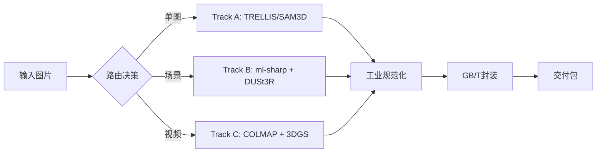

# Movie Assetization Pipeline (Pre-Study 2026)

**实验性项目** - 探索从2D电影画面到3D数字资产的自动化生成管线

## 📋 项目概述

这是一个**混合3D生成管线（Hybrid 3D Pipeline）**的技术验证项目，目标是将2D电影静帧/视频自动转换为可复用的3D数字资产。项目整合了多个前沿AI模型（ml-sharp, DUSt3R, TRELLIS, SAM 3D Objects），通过模块化编排实现端到端的资产生产流程。

**当前状态**: Phase 7 完成 - 技术验证阶段，已完成多条技术路线的实验对比

## 🎯 核心能力

### 已实现的技术路线

**路线A: 场景重建管线**
- ml-sharp (场景生成) → DUSt3R (几何重建) → 3DGS 训练
- 适用场景: 大场景/环境资产
- 状态: ✅ 可用

**路线B: 单图道具生成**
- TRELLIS (Image-to-3D): 直接从单张图生成3D模型
- 适用场景: 独立道具快速生成
- 状态: ✅ 生产就绪

**路线C: SAM 3D Objects (实验中)**
- Meta SAM 3D Objects: 分割 + 3D重建
- 适用场景: 多物体场景
- 状态: 🟡 实验验证中 (2026-02-21 刚跑通)

**路线D: 视频重建 (hobbyist_3dgs)**
- COLMAP/GLOMAP + 3DGS 深度训练
- 适用场景: 高保真场景重建
- 状态: 🟡 实验中 (experiments/hobbyist_3dgs/)

## 🚀 快速开始

### 环境要求
- **OS**: Linux (Ubuntu 22.04+)
- **GPU**: NVIDIA RTX A6000 或同等级 (24GB+ VRAM)
- **Conda**: 已安装并初始化

### 安装步骤

```bash
# 1. 克隆仓库
git clone <repo_url>
cd preStudy

# 2. 安装基础包
pip install -e .

# 3. 设置各个子环境 (参考 scripts/setup_*.sh)
bash scripts/setup_dust3r.sh
# ... 其他环境设置见 scripts/ 目录
```

### 运行管线

**基础用法 (TRELLIS后端)**:
```bash
python pipeline_runner.py --input /path/to/image.png
```

**使用SAM3D后端**:
```bash
python pipeline_runner.py --input /path/to/image.png \
    --asset_gen_backend sam3d_objects
```

**跳过耗时的场景生成**:
```bash
python pipeline_runner.py --input /path/to/image.png \
    --skip_scene
```

**高级选项**:
- `--output_root`: 自定义输出目录 (默认: `outputs/pipeline_demo`)
- `--skip_geometry`: 跳过DUSt3R几何重建
- `--roi_hint x,y,w,h`: 手动指定道具提取区域
- `--disable_skin_rejection`: 禁用肤色拒绝机制

### 输出结构

输出按会话ID组织在 `outputs/pipeline_demo/<image_name>/`:

```
outputs/pipeline_demo/06136/
├── report.html              # 📊 可视化报告 (从这里开始查看!)
├── scene_visual/            # 场景3DGS背景 (.ply)
├── dust3r/                  # DUSt3R几何点云 (.ply)
├── props/                   # 提取的2D裁剪 & 重光照检查图
└── props_3d/                # 最终3D资产 (.ply) + 元数据 (.json)
```

## 🏗️ 项目架构

### 目录结构
```
preStudy/
├── pipeline_runner.py       # 🎯 主入口 - 管线编排器
├── src/                     # 核心代码域
│   ├── core/                # 基础设施层 (runner_utils.py 等)
│   └── steps/               # 原子化能力单元
│       ├── scene_gen/       # ml-sharp 场景生成
│       ├── geometry/        # DUSt3R 几何重建
│       ├── assets/          # TRELLIS/SAM3D + 道具提取
│       ├── lighting/        # 光照探针提取
│       ├── export/          # GB/T 36369 封装
│       └── report/          # HTML报告生成
├── movie_asset_3dgs/        # 基础库 (EXR加载/色彩管理)
├── modules/                 # 外部模型依赖
├── experiments/             # 实验数据
├── scripts/                 # 工具脚本
└── docs/                    # 文档总目录
    ├── academic/            # [静态参考] 论文草稿与技术报告
    ├── architecture/        # [活动/演进] 核心架构方案 (包含最新的 technical_architecture)
    ├── guidelines/          # [活动准则] SOP守则与Agent协作规范 (如 AGENTS.md, GEMINI.md)
    ├── manuals/             # [实操记录] 安装手册与排障指南 (如 Trellis2)
    ├── planning/            # [历史蓝图] 早期项目规划、大方案与进度计划
    ├── research/            # [静态参考] 行业竞品与外部参考资料
    └── standards/           # [静态参考] GB/T 36369 等国家/行业标准
### 技术栈

| 组件 | 技术 | 环境 | 状态 |
|------|------|------|------|
| 场景生成 | ml-sharp | `sharp` | ✅ 可用 |
| 几何重建 | DUSt3R | `dust3r` | ✅ 可用 |
| 道具生成 | TRELLIS | `trellis` | ✅ 生产就绪 |
| 道具生成 | SAM 3D Objects | `sam3d-objects` | 🟡 实验中 |
| 视频重建 | COLMAP/3DGS | `base` | 🟡 实验中 |
| 资产提取 | GrabCut + 人脸检测 | `base` | ✅ 可用 |

### 数据流



## 📊 实验记录

### 最近实验 (2026-02-21)
- ✅ 剥离 `pipeline_runner.py` 基础设施并下沉至 `src/core`，完成第四阶段代码清理工作
- ✅ SAM 3D Objects 模型获取问题已解决
- ✅ 完成多个SAM3D实验 (outputs/pipeline_demo/06136, 09265等)

### 历史实验
- `experiments/hobbyist_3dgs/city_max/`: 362帧视频重建实验
- `experiments/video_asset_test/`: 视频资产化测试

## 🛠️ 故障排查

**常见问题**:

1. **TRELLIS确保使用 `spconv-cu118`，参考 `scripts/download_trellis.py`
2. **道具提取失败**: 调整 `harvest_hero_assets.py` 中的ROI阈值，或使用 `--roi_hint` 手动指定
3. **显存不足**: 使用 `--skip_scene` 跳过耗显存的场景生成步骤
4. **SAM3D模型缺失**: 参考 `scripts/setup_sam3d_objects.md`

**环境设置**:
- 各conda环境的详细设置见 `scripts/setup_*.sh`
- 确认 `modules/` 目录下有对应的模型代码

## 📚 相关文档

- **技术架构**: `docs/architecture/technical_architecture.md` - 3DGS vs NeRF对比、工程化设计
- **AI规范**: `docs/guidelines/AGENTS.md` - AI助手使用指南与代码风格约定
- **学术文档**: `docs/academic/manuscript_v2_supply_chain.md` - 资产供给链理论框架

## 🔬 研究方向

本项目是 **"电影内容资产化工程化转换与质量评测关键技术"** 研究的一部分，探索：
1. 生成式AI在电影资产生产中的应用
2. 多技术路线的对比与融合
3. 资产质量的客观评测体系
4. 符合国家标准(GB/T 36369)的资产管理

---
**项目状态**: 实验验证阶段  
**作者**: Zhang Xin  
**最后更新**: 2026-02-21
