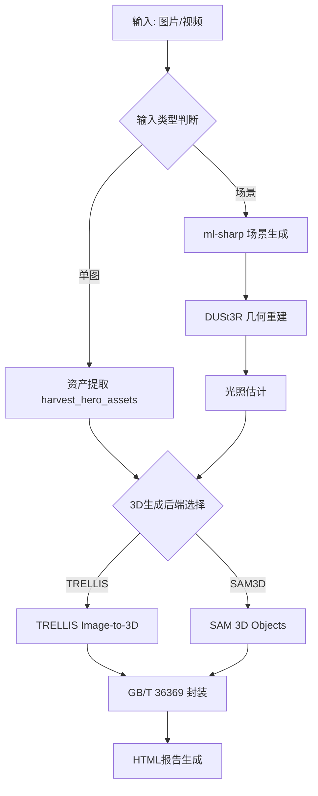
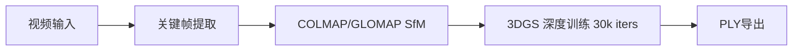

# 技术架构文档 (Technical Architecture)

**文档状态**: 实验验证阶段 - 反映当前多技术路线并行探索的真实情况  
**最后更新**: 2026-02-21

## 0. 架构演进说明

本项目处于**技术验证阶段**，目前并非单一技术路线，而是**四条并行技术路线的对比实验**：

| 路线 | 核心技术 | 适用场景 | 当前状态 |
|------|---------|---------|---------|
| **A: 场景重建** | ml-sharp + DUSt3R + 3DGS | 大场景/环境 | ✅ 可用 |
| **B: 单图生成** | TRELLIS (Image-to-3D) | 独立道具 | ✅ 生产就绪 |
| **C: SAM3D** | SAM 3D Objects | 多物体场景 | 🟡 实验中 (2026-02-21) |
| **D: 视频重建** | COLMAP/GLOMAP + 3DGS | 高保真场景 | 🟡 实验中 |

**设计理念**: 不预设"最优方案"，而是通过实际数据对比各技术路线的优劣，为后续决策提供依据。

## 1. 核心算法对比：3DGS vs NeRF (Algorithm Strategy)

在电影内容资产化场景下，我们对比了 **NeRF (Neural Radiance Fields)** 与 **3DGS (3D Gaussian Splatting)**：

| 维度 | NeRF (e.g., Instant-NGP) | 3DGS (Gaussian Splatting) | 结论 |
| :--- | :--- | :--- | :--- |
| **表示形式** | 隐式神经网络 (MLP) | 显示点云 (Gaussians) | **3DGS 胜出**：显式资产易于编辑、导入/导出标准引擎 (UE5/Unity)。 |
| **训练速度** | 快 (分钟级) | 极快 (分钟级) | **3DGS 胜出**：迭代反馈更即时。 |
| **渲染速度** | 慢 (需光追/Raymarching) | 极快 (光栅化，>100FPS) | **3DGS 胜出**：支持 4K+ 实时预览，符合导演审查需求。 |
| **抗噪能力** | 较强 (平滑) | 一般 (易产生 Floaters) | **NeRF 优势**：但 3DGS 可通过正则化项优化。 |
| **显存占用** | 低 (网络权重) | 高 (百万级高斯点) | **需优化**：通过 A6000 (48GB) 大显存优势 + 剪枝算法解决。 |

**当前实施策略**：
*   **路线A/D**: 采用官方 `3D-Gaussian-Splatting` (Inria) + hobbyist_3dgs 参考实现
*   **路线B**: TRELLIS (Microsoft) - 端到端 Image-to-3D
*   **路线C**: SAM 3D Objects (Meta) - 分割驱动的3D重建
*   **未来优化**: 考虑引入 `Scaffold-GS` 等变体进行显存优化

## 2. 当前管线架构 (Current Pipeline Architecture)

### 2.1 主管线 (pipeline_runner.py)

### 2.2 实验管线 (experiments/hobbyist_3dgs)

### 2.3 关键技术实现

**资产提取 (harvest_hero_assets.py)**:
- 人脸检测 (Haar Cascade) → 多人物ROI扩展
- GrabCut 智能分割 (生产环境计划替换为SAM2)
- 肤色拒绝机制 (可通过 `--disable_skin_rejection` 关闭)
- 支持手动ROI提示 (`--roi_hint x,y,w,h`)

**3D生成后端**:
- **TRELLIS**: 端到端Image-to-3D，输出高斯点云(.ply)
- **SAM3D**: 分割驱动，支持RGBA输入，利用alpha通道作为mask

**工业规范化** (计划中):
- 拓扑重构 (Retopology)
- UV烘焙
- 格式转换 (PLY → USD)

**元数据封装**:
- GB/T 36369 数字对象标识符 (DOIB)
- 最小可追溯集 (MTS): 内容摘要、权属、能力、环境

## 3. 质量评测体系 (Quality Evaluation - 规划中)

**当前状态**: 主要依赖人工视觉检查 + HTML报告

**计划指标**:

### 3.1 信号保真度
- PSNR (目标: > 32dB)
- SSIM (目标: > 0.95)
- LPIPS (目标: < 0.1)

### 3.2 资产完整性
- Floaters Ratio (漂浮点占比)
- Multi-view Consistency (多视角一致性)
- 拓扑质量 (面数/布线合理性)

### 3.3 实验对比维度
- **TRELLIS vs SAM3D**: 单图生成质量、拓扑清洁度、处理时间
- **单图 vs 视频**: 几何精度、纹理保真度
- **不同采样率**: 视频重建的最优帧间隔

## 4. 硬件与环境 (Hardware & Environment)

**当前平台**: NVIDIA RTX A6000 (48GB VRAM)

**环境配置**:
- OS: Ubuntu 22.04 LTS
- CUDA: 11.8 / 12.1
- Python: 3.10
- Conda环境隔离:
  - `sharp`: ml-sharp场景生成
  - `dust3r`: DUSt3R几何重建
  - `trellis`: TRELLIS 3D生成
  - `sam3d-objects`: SAM 3D Objects
  - `base`: 基础Python环境 (资产提取/封装/报告)

**显存管理**:
- TRELLIS: ~20GB (单次推理)
- DUSt3R: ~15GB (tiled模式)
- 3DGS训练: 根据场景规模动态调整

## 5. 当前交付物 (Current Deliverables)

**已实现**:
1. ✅ `pipeline_runner.py` - 端到端管线编排器
2. ✅ 模块化步骤脚本 (`src/steps/`)
3. ✅ HTML可视化报告
4. ✅ GB/T 36369 元数据封装

**实验中**:
- 🟡 SAM3D后端集成
- 🟡 视频重建管线 (hobbyist_3dgs)
- 🟡 多技术路线对比数据

**计划中**:
- ⏳ 自动化质量评测
- ⏳ 工业规范化后处理 (拓扑重构/UV)
- ⏳ USD格式导出
