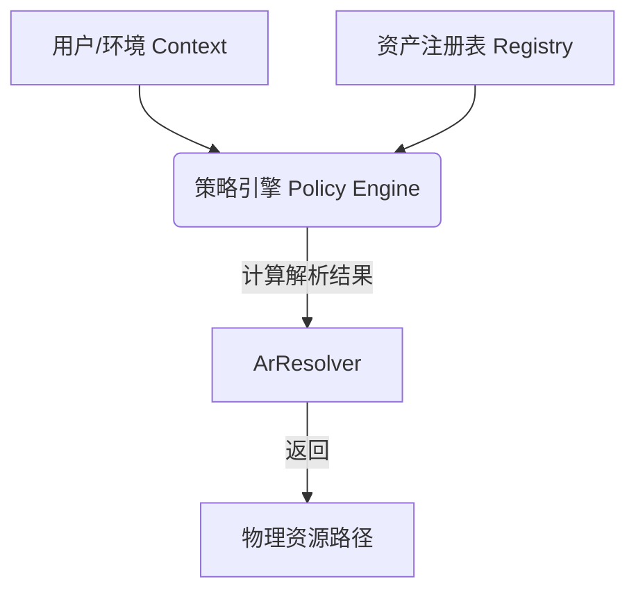

# ARP 核心机制设计：治理、策略与解析

**文档用途**：论文第六章/系统详细设计
**基于**：ArResolver 接口本身无 Governance，但通过 context 承载 Policy 的架构思想。

---

## 1. 核心模型：三层治理架构

我们将治理逻辑从“黑盒”中拆解为三个明确的工程对象，这构成了 ARP (Asset Routing Pipeline) 的大脑。



---

## 2. 资产注册表结构 (Asset Registry Schema)

这是“治理”的数据源头。只有注册表里的字段足够丰富，策略引擎才能做出复杂的判断。
这对应着我们在 `arp_wrapper.py` 中生成的 `MTS JSON` 的数据库形态。

| 字段域 (Domain) | 字段名 (Key) | 类型 | 示例值 | 治理意义 |
| :--- | :--- | :--- | :--- | :--- |
| **Identity (身份)** | `asset_id` | String | `IMG_2026_A1B2` | 全局唯一索引 |
| | `fingerprint` | Hash | `sha256:7f...` | 防篡改完整性校验 |
| **State (状态)** | `lifecycle_status` | Enum | `DRAFT` / `REVIEW` / `APPROVED` / `ARCHIVED` | 决定资产可见性 |
| | `security_level` | Int | `1` (公开) - `5` (绝密) | 决定访问权限 |
| **Provenance (溯源)** | `author_signature` | String | `zhangxin (AI-Assisted)` | 权属确认 |
| | `generation_config` | Json | `{seed: 42, steps: 20}` | 复现与审计依据 |
| **Format (格式)** | `variants` | List | `[glb, usd, ply]` | 根据不同 DCC 工具返回不同格式 |

---

## 3. 策略维度表 (Policy Dimension Matrix)

这是“策略引擎”的逻辑核心。我们定义“谁 (Context)” 在 “什么情况 (Condition)” 下能看到 “哪个版本 (Resolution)”。

**策略逻辑：`f(UserRole, Environment, AssetState) -> ResourcePath`**

| 策略场景 | 输入: 用户角色 (Role) | 输入: 运行环境 (Env) | 输入: 资产状态 (State) | **输出: 解析行为 (Resolution Action)** |
| :--- | :--- | :--- | :--- | :--- |
| **场景 A: 正常创作** | Artist (美术) | Workstation (工作站) | DRAFT (草稿) | ✅ **Allow**: 返回本地高模，用于编辑 |
| **场景 B: 导演审核** | Director (导演) | ReviewTool (由于工具) | DRAFT (草稿) | 🔄 **Remap**: 强制返回轻量化预览版 (Proxy) |
| **场景 C: 生产发布** | PipelineBot (机器人) | RenderFarm (农场) | DRAFT (草稿) | ⛔ **Deny**: 阻断渲染，报错"资产未批准" |
| **场景 D: 外部合作** | Outsourcer (外包) | External (外部) | SECURE_L5 (绝密) | ⛔ **Deny**: 隐形模式，解析为空或占位符 |
| **场景 E: 审计追溯** | Auditor (审计员) | AuditTool (审计端) | ANY (任意) | ℹ️ **Inspect**: 不返回模型，返回 MTS 溯源日志 |

---

## 4. ResolverContext 设计 (Context Definition)

这是 ArResolver 的“钥匙”。在代码中，我们需要构建这样的 Context 对象传给解析器。

```python
class ARPResolverContext:
    def __init__(self):
        # 基础环境上下文
        self.app_name = "Maya"          # 当前宿主软件
        self.pipeline_stage = "Layout"  # 当前工序阶段
        
        # 治理上下文 (Governance Context)
        self.user_token = "u_zhangxin_007" 
        self.security_clearance = 3     # 用户密级 (0-5)
        self.intent = "read_geometry"   # 访问意图 (read/write/publish)
        
        # 时间维度 (用于快照回溯)
        self.timeline_snapshot = None   # 如果不为None，解析该时间点的历史版本

    def to_json(self):
        return {
            "ctx_ver": "1.0",
            "security": self.security_clearance,
            "stage": self.pipeline_stage
        }
```

---

## 5. 论文/设计说明话术

> “本系统通过扩展 ArResolver 接口，构建了**基于上下文的动态解析机制 (Context-Aware Dynamic Resolution)**。我们并不在底层的 USD 文件中硬编码权限，而是将治理逻辑上浮至**解析时刻 (Resolution Time)**。
>
> 当 `ArResolver.Resolve(asset_path)` 被调用时，系统不仅查找物理文件，更会结合当前的 `ARPResolverContext` 与预定义的**策略维度表 (Policy Matrix)** 进行实时计算。这种架构实现了‘**加载即合规 (Compliance upon Loading)**’——如果一个资产未获批准或密级不足，它在文件系统层面甚至对用户是‘不可见’的，从而从根源上杜绝了错误资产流入下游管线的风险。”

---

## 6. 总结

*   **表 (Registry)**：记账的。
*   **规则 (Policy)**：判刑的。
*   **钥匙 (Context)**：进门的。
*   **ArResolver**：执行这一套流程的保安。

通过这套设计，我们将抽象的“治理”变成了具体的、可编码的“If-Else”逻辑表。
