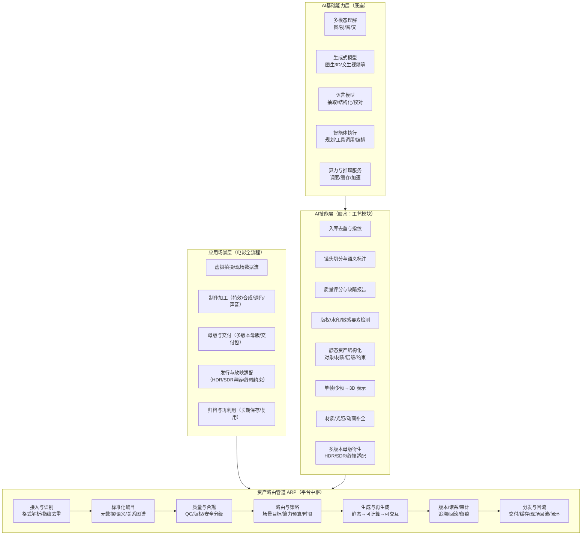
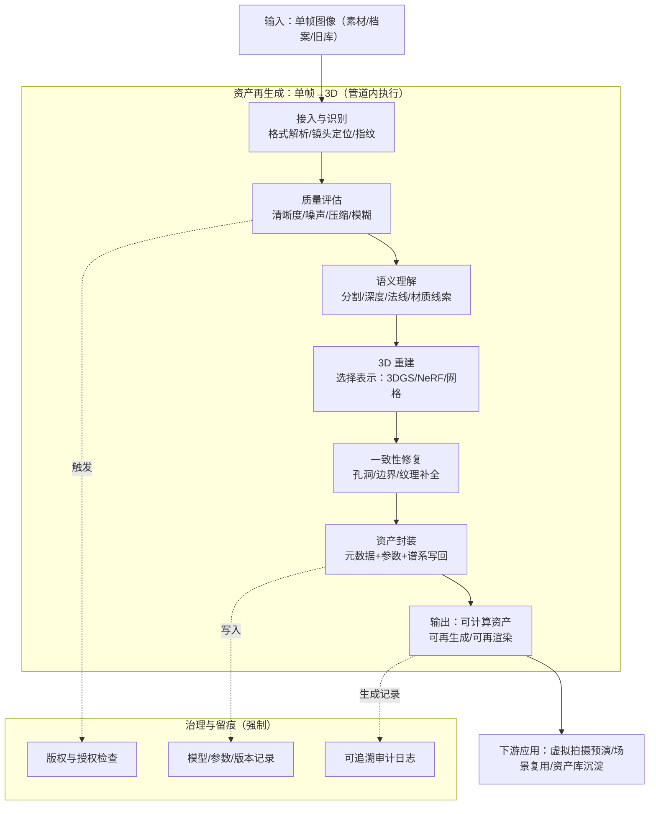
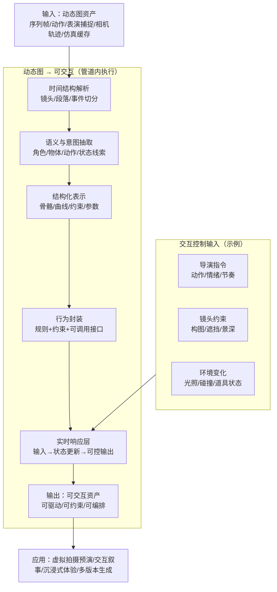

# 面向生成式人工智能时代的国家电影数字资产平台：以资产路由管道为核心的全程性架构与设计方法

## 摘要

2025—2026 年间，生成式人工智能、多模态大模型与智能体工程推动媒体内容生产从“人工制作—文件交付”加速转向“算法生成—能力交付”。在此背景下，传统以静态文件存储与检索为中心的数字资产平台逐渐难以支撑电影工业对高规格视听质量、公开放映的确定性呈现、多版本体系治理与长期可演化能力的综合要求。本文提出一种面向国家电影数字资产平台建设的顶层设计范式：以“资产路由管道（Asset Routing Pipeline, ARP）”为平台中枢，以 AI 基础能力为底座，以 AI 技能（可复用工艺模块）为胶水，构建贯穿影片加工全流程的全程性架构。该范式强调将资产从“文件结果对象”提升为“可治理资产包”，将生成与加工过程对象化为可追溯、可审计、可回放的处理节点与谱系记录，从而在不绑定具体技术路线的前提下兼容存量资产、吸收新兴技术并保持电影工业的确定性与合规性。本文给出平台对象模型与管道功能定义，提出面向“确定性呈现 + 多版本体系治理”的机制化约束，并通过“单帧图像→3D 资产再生成”和“动态图→可交互资产”两个典型链路示例说明该架构的可行性与可扩展性。

**关键词**：国家电影数字资产平台；资产路由管道；生成式人工智能；多版本治理；确定性呈现；可计算资产；可交互资产

---

## 1 引言

电影属于媒体行业，但它是媒体中最接近“工程项目”的形态：工序链深、协作主体多、版本体系复杂、质量门槛高且最终面向公众空间的公开放映。电影的公共放映属性与社会性观看使其资产不只是生产资料，更是公共文化产品；而电影长期承载行业最高视听体验上限（画面与声音规格），又要求其资产在不同时间与不同放映系统上具有高度一致的观感结果。与此同时，生成式 AI 正在把内容从“文件”推向“函数”：越来越多内容不再以固定文件作为终态，而以模型、参数与生成规则形式存在，资产的本质由“结果对象”转向“生成能力对象”。这使得传统数字资产平台面临结构性挑战：若仍以静态资产归档为核心，平台将难以承载资产的再生成、能力沉淀与跨流程复用，也难以在未来技术快速演进中保持接口稳定与治理一致性。

因此，国家电影数字资产平台的建设需要从“管理文件”升级为“管理资产生成与演化能力”的基础设施。本文围绕这一目标提出“以资产路由管道为核心”的全程性架构：以 ARP 作为平台中枢贯穿影片加工全流程；以 AI 基础能力提供多模态理解、生成与智能执行；以 AI 技能层将行业知识与制作经验固化为可复用工艺模块，在保证电影工业确定性与合规治理的前提下，兼容存量资产并吸收未来技术。

---

## 2 背景与问题：从文件管理到能力管理

### 2.1 生产范式变化：内容正在变成可计算对象

在生成式模型、多模态模型与智能体工程推进下，内容生产呈现“按需生成、快速派生、持续迭代”的特征。对资产平台而言，关键变化不是某一模型的出现，而是资产形态的变化：

* **静态资产**：以文件为终态（模型、贴图、音视频、母版等），适合归档与分发。
* **可计算资产**：资产核心是“生成能力单元”（模型权重/算法/参数模板/约束规则），文件只是中间态。
* **可交互资产**：在可计算基础上具备实时响应能力（输入→状态更新→可控输出），适用于虚拟拍摄预演、交互叙事与沉浸式体验等新场景。

资产平台若仅管理静态文件，将难以沉淀“生成能力”，也无法系统性支持资产再生成与跨媒介复用。

### 2.2 电影的差异化本体诉求

虽然电影与其他媒体共享“内容生产—加工—分发”的基本链条，但电影在本体上具有两项必须写入平台架构的核心诉求：
（1）**公开放映与社会性观看**：面向公众空间呈现，需要更高等级的可追溯、稳定性与合规治理。
（2）**最高视听体验上限**：画面与声音质量门槛更高，要求工程级确定性呈现，而非“差不多可用”。

由此，电影资产平台必须原生支持：确定性呈现、多版本体系治理、质量基线（QC）与合规审计，同时仍需面向未来技术演进保持开放与可扩展。

---

## 3 设计目标与原则：从理念收敛为方法论

本文提出的顶层目标是：**把国家电影数字资产平台从“资产仓库”升级为“能力型基础设施”**。其价值不在于资产数量堆积，而在于对内容生产能力的长期沉淀、组织与释放。为达到这一目标，平台设计遵循三项原则：

**原则 P1：资产对象抽象化**
资产从“文件”提升为“可治理资产包”：包含内容本体、结构化描述（元数据/语义标签/关系图谱）与衍生关系。

**原则 P2：过程对象化**
将生成、加工与派生过程纳入平台管理：每一次处理形成“处理节点 + 生成记录”，可追溯、可审计、可回放。

**原则 P3：能力平台化**
AI 能力不以“绑定某模型”存在，而以可替换的基础能力单元与可复用技能模块存在，保证平台对未来技术演进的兼容性。

---

## 4 全程性架构：以管道为中心、AI 为底座、技能为胶水

### 4.1 总体架构说明

平台整体采用三层结构：

* **资产路由管道（ARP）**：平台中枢，贯穿影片加工全流程；负责编目、质量合规、策略路由、再生成、版本谱系与分发回流。
* **AI 基础能力层**：提供多模态理解、生成式建模、语言模型能力与智能体执行能力，支持算力与推理服务。业内常见的基础设施生态可来自如 NVIDIA 等算力与推理加速体系，或来自创作工具生态如 Epic Games 等引擎体系。
* **AI 技能层（Skills）**：把行业知识、标准约束与工艺经验固化为可复用流程模块，作为连接底座能力与管道流程的“胶水”。

### 4.2 图1：平台核心架构图（Mermaid）

---

## 5 管道机制化约束：确定性呈现 + 多版本体系治理

电影平台设计不能止于“有管道”，必须把电影核心诉求编码为机制约束。本文选择两条最能同时体现电影特性与平台可落地性的约束作为机制主线：**确定性呈现**与**多版本体系治理**。二者关系可表述为：确定性呈现回答“同一版本能否稳定复现”，多版本治理回答“版本分叉后如何仍然可控与可追溯”。

### 5.1 处理节点与谱系记录：过程对象化的核心

管道把任意一次处理操作抽象为“处理节点（Processing Node）”，并生成结构化“生成记录（Generation Record）”，多个记录串联为资产谱系图谱（Generation Graph）。该抽象不依赖具体技术路线：传统算法、生成式模型、语言模型、智能体编排都可被视为处理节点，只要满足最小记录要求即可进入治理体系。

**处理节点最小记录集（顶层要点）**：

* 输入资产稳定标识（指纹 + 关键属性摘要）
* 工具/模型/技能标识与版本
* 参数/策略摘要（不要求复刻底层全部细节，但要求可解释）
* 输出资产稳定标识
* 权限/授权边界与执行责任主体（满足审计与合规）

### 5.2 版本类型建模：把“变化”分门别类治理

电影资产版本变化可在顶层抽象为四类，以施加不同治理强度：

* **母版一致性派生**：容器适配与工程转换（强调可复现回放）。
* **创作性变体**：剪辑、调色、声音设计等创作变更（强调责任主体、审批与注释）。
* **AI 再生成派生**：重建/细化/补全等生成式派生（强调模型版本、输入条件与随机性控制策略记录）。
* **交付封装派生**：面向渠道/终端的交付组合（强调与母版及派生版本的明确关联）。

### 5.3 验证与审计闭环：生成—记录—校验—回放—审计

管道形成闭环：

1. 生成：处理节点产生输出；
2. 记录：写入生成记录并更新谱系；
3. 校验：质量指标与合规检查（必要时抽样人工复核）；
4. 回放：在需要时基于相同输入与处理节点条件重放；
5. 审计：面向公开放映与合规要求进行追溯与责任界定。
   该闭环的目标不是追求所有生成过程数值完全一致，而是把不可控的不确定性限制在可治理范围内，保证工程意义上的可解释、可追溯与可复现到可接受误差。

---

## 6 两个典型链路：资产再生成与资产形态升级

为说明架构不仅是概念组合，而是可落地的管线化方法，本文给出两个典型链路作为示例。

### 6.1 图2：单帧图像→3D 的资产再生成链路（Mermaid）

该链路展示静态资产如何在管道内被转换为可计算资产：输入单帧图像，经质量评估与语义理解后选择 3D 表示进行重建，再进行一致性修复与资产封装，最终沉淀为可再生成、可再渲染的资产包，并将谱系与参数纳入审计体系。

### 6.2 图3：从动态图资产到可交互资产的升级链路（Mermaid）

该链路展示资产形态升级：把“带时间维度的内容”（序列帧、动作、表演捕捉、相机轨迹、仿真缓存等）解析为结构化表示与行为封装，使其具备实时响应能力，从而支撑虚拟拍摄预演、交互叙事与多版本生成。

---

## 7 图表与数据结构：论文中的“硬支撑”

### 7.1 表1：资产形态分层与平台能力映射

| 资产形态  | 核心载体             | 平台主要能力        | 典型用途      |
| ----- | ---------------- | ------------- | --------- |
| 静态资产  | 文件（模型/贴图/音视频/母版） | 存储、检索、归档、分发   | 归档、复用、交付  |
| 可计算资产 | 模型/参数/规则 + 中间态文件 | 再生成、能力封装、策略路由 | 生成派生、自动加工 |
| 可交互资产 | 行为/约束/接口 + 状态机   | 实时响应、可控输出、编排  | 虚拟拍摄、交互叙事 |

### 7.2 表2：版本类型建模与治理重点（顶层）

| 版本类型     | 典型场景               | 治理重点            | 与确定性呈现关系     |
| -------- | ------------------ | --------------- | ------------ |
| 母版一致性派生  | SDR/HDR、封装、码率、终端适配 | 参数继承、可回放、QC 基线  | 强一致性要求       |
| 创作性变体    | 剪辑/调色/声音设计变化       | 责任主体、审批、变更注释    | 允许表达差异，但需可追溯 |
| AI 再生成派生 | 单帧转 3D、自动细化/补全     | 模型版本、输入条件、随机性控制 | 通过记录与校验实现可治理 |
| 交付封装派生   | 渠道/地域/语言交付包        | 关联关系明确、授权边界     | 通过谱系保证可审计    |

---

## 8 原型验证思路：轻量实现支撑论文可行性

本文主张的并非“必须实现一个完整国家级系统”，而是提出可验证的设计范式。对个人研究者而言，可用轻量原型验证关键闭环：

* 用脚本/服务实现资产指纹生成；
* 将任意处理操作（包括 AI 推理、工具链转换、规则化处理）包装为处理节点；
* 输出结构化生成记录，形成谱系；
* 通过质量校验与回放逻辑验证“可追溯、可审计、可回滚”的工程闭环。
  在 AI 集成层面，智能体与工具接入可采用“工具/上下文协议化”的思想（如业界提出的 MCP 一类协议理念），以实现技能注册、权限控制与工具调用的标准化；相关生态示例可参见 Anthropic 等公司推动的协议与工具化趋势，但本文强调其为“可选实现路径”，并不把平台绑定在任何单一协议或厂商之上。

---

## 9 讨论：为何该范式适用于电影而非泛媒体复刻

电影的公开放映属性与最高视听规格要求，使“确定性呈现”不只是放映端问题，而是贯穿资产加工全流程的系统性约束；多版本体系更使版本治理成为平台必须内生的结构能力。本文架构的价值恰在于：

* 在理念上，把平台从“文件管理系统”提升为“生产能力组织系统”；
* 在机制上，把过程对象化，形成可追溯、可审计、可回放的谱系治理；
* 在演进上，用技能层封装工艺，使新模型、新工具可替换接入而不破坏治理一致性；
* 在行业适配上，把电影的质量基线、合规审计、作者性边界与版本治理写入管道约束。

因此，该范式既具媒体行业通用性，又能体现电影工业的高规格要求，并为国家级平台的长期演进提供稳定接口与治理框架。

---

## 10 结论与展望

本文面向生成式人工智能时代国家电影数字资产平台建设，提出“以资产路由管道为核心”的全程性架构范式：以 ARP 为中枢贯穿影片加工流程，以 AI 基础能力为底座提供多模态理解与生成能力，以技能层作为工艺胶水沉淀行业知识与流程经验。通过将资产对象抽象化、将过程对象化并构建谱系化治理，平台能够在不绑定具体技术路线的前提下兼容存量资产并吸收未来技术。本文进一步给出确定性呈现与多版本体系治理的机制化约束，并通过单帧转 3D 与动态图转交互资产两个典型链路展示资产再生成与形态升级的可行路径。未来工作可在不改变顶层范式的前提下，进一步补充：（1）电影级 QC 指标体系与自动化评估基线；（2）面向跨主体协作的权限、授权与合规模型；（3）面向交互资产的行为一致性与可控性评测方法。总体而言，本文形成的不是某一具体实现方案，而是一种可指导国家电影数字资产平台规划与建设的顶层设计思路与管道架构框架。

---

## 参考文献（占位建议）

> 这里你后续按期刊要求补 10–20 条即可（行业标准/会议论文/平台白皮书）。可包括：

* 数字资产管理与媒体供应链相关综述
* 生成式 3D（NeRF、3DGS、单图重建）相关代表性论文
* 电影制作与母版、色彩与声音标准/规范
* 工程化 MLOps / 可追溯性 / 数据谱系治理相关资料
* MCP/工具协议/智能体编排相关公开材料（若期刊允许）
