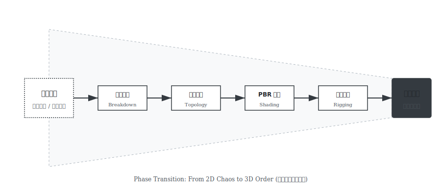

# 从资产仓库到资产供给链：生成式人工智能时代国家电影数字资产平台建设研究

作者：zhangxin

---

## 摘要

生成式人工智能的大规模应用，正在改变电影内容的生产方式。传统以文件归档为核心的资产管理模式，难以应对以模型能力为核心的新型生产场景：生成内容的来源难以界定，生成过程难以复现，资产的长期价值因环境依赖而变得脆弱。

针对这一问题，本文提出国家电影数字资产平台应由"资产仓库"转型为**"资产供给链"**，并构建以**资产路由管线（ARP）**为中枢的治理架构。该架构在输入侧强制推行身份化登记，在过程侧实施作业图编排与节点级审计，在输出侧实现凭证化封装与防篡改校验，从而将非确定性的生成活动收敛为可管理的工业流程。

本文以 Image-to-3D 场景为验证实例，初步证明了该体系的可行性。研究认为，上述架构可为国家电影数字资产平台的规划与建设提供技术层面的参考。

## 关键词

生成式人工智能；电影数字资产；资产供给链；资产路由管线；数字主权

---

## 第一章 引言

人工智能在电影制作中的角色正在发生变化。早期的应用集中在剪辑辅助、画面修复与特效合成等后端环节，而如今，其触角已延伸至剧本生成、概念设计、场景构建乃至角色生成，开始直接影响内容本身的形成。

在实际制作现场，这种变化表现得很具体：越来越多的高质量画面不再完全依赖人工逐帧搭建，而是由模型生成多个候选结果，再由创作者筛选、精修与整合。电影生产的路径，正在从单一的人工线性工序，演变为人工与模型推理相互交织的网状结构。

这一变化带来了一个必须正视的问题：**资产的内涵变了**。过去，电影数字资产以成片、素材、模型文件等"结果性对象"为核心，存好就行。但现在，决定内容能否再生产的关键因素，已经前移到了模型权重、参数配置、提示词策略与推理环境等"过程性要素"上。这些要素不直接表现为画面，却在底层决定了能生成什么、生成得怎么样。

问题随之而来：现有以文件为中心的管理体系，难以完整记录这些过程性要素。结果是，资产来源难以追溯，生成过程难以复现，核心能力在人员更迭或环境升级后往往无法继承。

从国家战略层面看，文化数字化战略与"人工智能+"行动都在推动文化资源的数字化转化与高效供给。对电影工业而言，这不仅意味着技术升级，更要求数字资产平台在保存文化资源的同时，必须具备回应生成式生产变化的能力——在公共服务、合规监管与要素流通等方面形成基础性支撑。

基于上述判断，本文认为国家电影数字资产平台的建设目标，应当由单纯扩容的"仓库模式"，转向能够介入资产生成与流转全过程的"基础设施模式"。为此，本文提出由"资产仓库"向"资产供给链"转型的总体思路，并构建以资产路由管线（ARP）为中枢的平台架构。

---

## 第二章 行业挑战：技术结构变迁下的治理必然性

### 2.1 技术结构变迁与治理机制的断层

随着生成式人工智能全流程渗透，模型能力与算力资源逐步取代传统的人力工时，成为新的关键生产要素。电影内容的形成逻辑，已由确定的“线性工序”演变为非确定性的“输入意图—模型推理—结果生成”模式。

在这一技术结构下，原有围绕“结果文件”与“人工创作”建立的治理体系开始暴露出明显的适配断层，主要体现在三个维度：

首先是来源界定的模糊性。生成内容往往是算法逻辑与人类意图混合的产物，难以仅依据传统作者逻辑界定清晰的版权边界与创作来源；

其次是过程约束的失效性。生产过程高度依赖特定模型版本与推理框架，传统的制片管理制度难以对“黑盒”化的模型推理过程进行有效约束与质量把控；

最后是资产继承的脆弱性。资产价值高度绑定于特定的软件环境、算力配置与参数组合，一旦环境缺失，即便文件尚存，其再生产能力也会瞬间丧失。

因此，国家电影数字资产平台的建设重心必须发生偏移：由关注“存了什么结果文件”，转向关注“调用了什么模型能力、经历了哪些生成过程、形成了怎样的资产结果”。这一转向并非概念游戏，而是由技术发展趋势与工程实践中的痛点共同决定的必然选择。

### 2.2 国家文化数字化战略的落地指向

国家文化数字化战略与“人工智能+”行动，为电影工业智能化转型提供了宏观指引，但对平台建设而言，核心挑战在于如何将这些原则性要求转化为可实施、可落地的技术能力体系。

具体而言，政策要求需要在以下三个层面转化为平台的具体功能：

在确权层面，需要突破传统以结果文件为对象的确权方式，逐步建立以生成过程为对象的确权机制，将模型、参数、提示词与作业实例等“过程要素”纳入统一的溯源与登记范围，使权属界定能够沿生成路径向前端回溯；

在监管层面，需要改变传统事后抽检为主的被动监管模式，转向在生产链路中实时嵌入规则校验与技术约束，在生成过程中同步完成模型标识、算法指纹与可信存证的绑定，实现监管关口的前移；

在要素流转层面，需要拓展传统的文件交付模式，建立针对模型能力与工序模板等新型生产要素的合规流通与复用机制，支撑资产在跨项目、跨场景中的高效配置。

上述能力要求共同构成了平台建设的基本边界，也是后续架构设计的直接依据。

---

## 第三章 资产形态的分级模型

对应生成式生产条件下的技术结构，电影数字资产已无法被单一的“文件”概念所覆盖。基于资产在生产过程中的作用形态与治理需求，本文将其划分为三个演进层级：

第一类是静态资产。

此类资产涵盖传统意义上的三维模型、贴图、音视频成片及工程文件，是直接对应具体画面结果的交付对象。它们构成了国家文化资源的存量底座，其治理重点在于高保真保存与元数据关联。但在生成式语境下，单纯的静态资产面临“有结果无能力”的困境，一旦脱离原始制作环境，其可编辑性与再利用价值会大幅衰减。

第二类是可计算资产。

这是生成式时代的核心生产要素，包括模型权重、微调参数、提示词配置与推理策略等。这类资产本质承载的是“生成能力”本身，而非某一次特定的生成结果。它们具有极强的复用价值与组合潜力，但同时高度依赖特定计算环境，需平台提供标准化封装与运行保障。

第三类是可交互资产。

这是面向未来的前沿形态，包括包含可执行行为逻辑的数字人或智能体实例。该类资产的运行表现并非预先固化，而是在与环境的实时交互中动态生成，对平台的实时监管与责任界定提出更高要求。

据此形成分级治理思路：以静态资产筑牢文化存量底座，以可计算资产激活核心生产要素，以可交互资产探索智能化应用边界。这种分级为后续平台架构中不同管线的差异化处理提供对象基础。

---

## 第四章 平台总体架构与核心能力体系

### 4.1 平台到底是什么：从“技术中台”到“数字海关”

长期以来，业内习惯将平台定义为存储资源的“超大网盘”或算力堆叠的“云端农场”。然而，在 AIGC 内容爆发式增长的今天，这种被动的基础设施定位已难以为继。面对海量、来源不明且权属模糊的 AI 生成素材，国家电影数字资产平台的核心定位应当跃升为**电影工业的“数字海关”**。这一隐喻揭示了平台必须履行的三项核心铁律：

**第一，进门先登记（输入身份化）**。
所谓“海关”，首要职能便是**拒止匿名入境**。任何试图进入生产链路的素材——无论是手绘草图、扫描模型，还是 AI 生成的提示词——都必须在接入瞬间绑定唯一的**数字身份证（Object ID）**。如果缺失这一环，平台将沦为堆满无主数据的数字沼泽，既无法溯源其来路，也无从追踪其去向。

**第二，干活按规矩（过程规则化）**。
AI 生成最忌讳“开盲盒”。平台必须杜绝模型推理的随意性，强制将每一次生成任务转化为有迹可循的**“施工图”**。系统需详尽记录每一步调用的模型版本、参数设定与算力消耗。唯有如此，导演眼中的“好画面”才能成为可稳定复现的工业资产，而不是不可再生的随机运气。

**第三，出门带凭证（输出凭证化）**。
当资产离开平台交付给剧组时，绝不能仅提供一个裸文件，必须附带包含完整谱系信息的**“数字通行证”**。这张凭证清晰标注了资产的生成者、授权范围与使用边界。这不仅免去了后续环节的侵权担忧，更为跨机构协作提供了不可篡改的责任底座，彻底终结了“谁用谁背锅”的行业困境。

### 4.2 资产路由管线（ARP）：从逻辑调度到全域治理

为支撑“数字海关”的宏大职能，必须构建一套能够穿透底层数据与上层业务的核心引擎。本文提出的**资产路由管线（Asset Routing Pipeline, ARP）**，在本质上区别于传统的吞吐型调度器。它不以单纯的算力利用率为目标，而是将**“可治理性”**置于首位，通过一套以规则驱动的四层技术架构，实现了从要素管理到交付凭证的全链路闭环。

**首先是对象层（Object Layer），确立了资产的可追溯基石。**
ARP 在入口处强制建立了一套**最小可追溯集（MTS）**体系。系统并不直接存储冗余的原始数据，而是提取其核心指纹（Content Hash）、权属来源与生成成分，构建出一个轻量级但不可篡改的“数字黑匣子”。这确保了平台内流转的每一个对象，无论经过多少次迭代，其原始基因都能被毫秒级定位。

**其次是能力层（Capability Layer），实现了工具的制度化准入。**
针对 AI 模型迭代快、版本乱的痛点，ARP 建立了严格的**能力单元封装机制**。任何算法模型或 DCC 工具唯有经过接口规范化封装、性能边界测试与合规备案后，才能获得 Capability ID 并纳入调度池。这种机制有效地将不可控的开源代码转化为可管、可控的标准化工业组件。

**再者是作业层（Job Layer），完成了生成过程的结构化编排。**
ARP 摒弃了随机试错式的生成模式，转而采用**作业图（Job Graph）**技术。系统将用户的模糊需求解析为一张包含精确输入输出约束的有向无环图（DAG），并对图中的每一个节点实施**同步审计**。这意味着，每一次“文生图”或“图生3D”的操作，不仅是在消耗算力，更是在实时生成合规证据与质量报告。

**最后是输出层（Output Layer），固化了资产的终极价值。**
作业终结时，ARP 自动生成与资产强绑定的**凭证对象（Credential Object）**。它将生成链路的全部 ID 引用、MTS 摘要与授权声明封装为一体，并加盖数字签名。这使得资产在跨越数个制作团队流转后，依然具备法律意义上的权属自证能力，从而真正构成了工业级供应链的信任锚点。

---

## 第五章 顶层架构设计：基于多维管线协同的治理网络

围绕 ARP 这一技术中枢，平台整体架构不应停留在“列出若干子系统”的静态清单，而应体现不同管线如何围绕对象与作业图协同工作。本文将顶层架构归纳为“七类管线群 + 两条横向总线”。

### 5.1 管线分类概念设计：三大职能域

面对复杂的工业供需场景，任何简单的线性堆叠都无法应对海量并发与异构输入。因此，本架构从职能属性出发，将七类实体管线抽象为**“接入、作业、治理”**三个核心概念域，并在设计上确立了标准先行、作业灵活、治理内生的逻辑闭环。

#### **第一类：标准化接入域（The Normalizers）**

该域位于平台的最外层，充当着整个生态的**“归一化过滤器”**。在电影工业的现实环境中，输入侧充斥着极度离散的数据形态——从导演手绘的草图、摄影组扫描的点云，到编剧的文本大纲；供给侧则混杂着异构的算法工具——从开源社区的预训练模型到商业软件的私有引擎。如果任由这种混乱穿透到核心生产区，系统势必崩溃。

因此，标准化接入域的核心职责是**防御性收敛**。它强制要求所有进入平台的素材必须经过**“输入洗礼（Input Normalization）”**，即清洗数据噪声并绑定唯一的对象标识符（DOID）与元数据时间戳（MTS），从而拒绝任何“无主数据”入境。同时，对于所有的计算工具，系统执行严格的**“能力注册（Capability Registration）”**，要求提供标准化的接口封装与合规签章。只有经过这一域的标准化处理，外部的离散要素才能转化为平台内部可识别、可调度的合法对象。

#### **第二类：动态作业域（The Operators）**

越过接入层后，资产进入了平台的**生产核心**。不同于传统工业流水线的线性传导，动态作业域强调**“按需路由”**的非线性调度能力。它是 ARP 的执行机构，负责根据作业图（Job Graph）的动态指令，驱动算力与算法对资产进行增值加工。

该域的工作流由**策略路由中枢（ARP Core）**主导，它像大脑一样解析需求意图，将宏观任务拆解为具体的工序节点，并动态匹配最优算力路径。具体的生产动作则由**工业工序矩阵（Process Matrix）**承担，这并非单一车间，而是一个自适应的加工网络：无论是将剧本拆解为数据的**结构化工序**，还是实现无中生有的**生成式工序**，亦或是修正拓扑与 UV 的**规范化工序**，均以原子化的“能力单元”形式存在。这种矩阵式设计确保了平台既能支持单点任务的快速生成，也能承载复杂资产的全流程构建。

#### **第三类：内生治理域（The Governors）**

与生产链路并行运转的，是平台的**“免疫系统”**——内生治理域。为了打破“先发展后治理”的被动局面，我们将监管规则直接代码化，并嵌入到每一个生产环节之中。该域的一个显著特征是：**它不直接生产任何资产，但掌握着资产交付的最终否决权**。

在运行机制上，**合规与安全管线**实时扫描每一次生成的中间结果，一旦监测到内容风险或版权冲突，即刻触发熔断机制。而**数字化职能（Agent）**则替代了传统繁琐的人工填表工作，由智能体全天候维护版本谱系、触发随机抽检并固化证据链。最终，**凭证化封装**解决了“最后一公里”的信任难题，它将裸数据封装为包含防伪哈希锁的交付包，确保资产在流通过程中来源可查、去向可追。这种设计实现了管治与生产的**零距离耦合**，是国家级平台区别于普通工具软件的本质特征。

### 5.2 两条横向总线：贯穿全链路的稳定底座

为避免“管线群各自为政”，顶层架构需要两条横向总线贯穿：

**（A）身份与谱系总线**

统一管理对象 ID、能力 ID、作业 ID 的映射关系，维护版本谱系、依赖关系与引用链，使任何资产都能回答三个问题：从哪里来、经过什么、可否复现。

**（B）证据与审计总线**

统一承载过程日志摘要、质检结论摘要、合规校验结果、签名与时间戳，形成可对外核验的证据底座，使平台实现“边生产、边固化证据”。

通过“七类管线群 + 两条横向总线”，平台既能支撑行业的高频生产，也能在制度与技术两条线上保持稳定的治理能力，从而把快速变化的算法世界持续“翻译”为电影工业可以长期依赖的确定性结构。

---

## 第六章 实践验证：基于 Image-to-3D 的资产供给链

为验证上述架构的工程可行性，我们选取了当前影视制作中需求最迫切、但质量最不可控的“图像转三维”场景，构建了一条标准化的资产供给链。该验证不仅旨在打通技术链路，更在于检验 ARP 架构在面对不确定性输入时的路由管控能力，实现从“孤立脚本”向“可审计管线节点”的范式跃迁。

### 6.1 验证场景定义：从单图到工业级三维资产

本实验选取电影美术设计中的“道具快速建模”为典型场景。对于导演或概念设计师提供的非标准二维草图（Concept Art），系统通过 ARP 管线调度，依次完成蓝图标准化、几何生成、光影解耦与物理注入，最终输出符合 DCI 规范的工业通用件。

选择这一场景的原因很务实：它既能解决新片制作中创意落地慢的问题，也能让资料馆里海量的老电影海报、手稿“活”起来，变成可用的数字资产。

### 6.2 资产供给链的构建步骤：四阶段治理模型

在 ARP 架构中，我们将原本黑盒化的模型推理过程重构为四个严密的治理阶段，确保每一步都符合工业级标准要求：

**第一阶段：输入侧身份化**
针对行业长期存在的“文件名管理乱象”，系统强制推行“无主数据禁入”机制。任何进入管线的草图素材，无论来源何处，都必须通过毫秒级感知哈希（pHash）算法提取**数字基因**，并绑定全局唯一的 Object ID。这一机制彻底消灭了冗余文件，确保资产在全生命周期的每一次流转都能被精确溯源，从源头上遏制了数据混乱。

**第二阶段：能力单元调用**
我们严禁运行任何“无版本、无记录”的野生脚本。在这一阶段，系统将生成模型封装为受控的“能力单元”，强制记录随机种子（Seed）与推理步数，并优先调度**华为昇腾**与**寒武纪**等国产算力。这种对底层生产环节的全面管控，不仅实现了核心技术的自主可控，更确保了工程级的**百分百复现**——即便一年后导演需要修改某个镜头，技术人员也能精确还原当时的生成现场。

**第三阶段：工业管线干预**
为了解决 AI 生成模型（如 TRELLIS）普遍存在的三角面混乱与 UV 缺失问题，ARP 在推理结束后强制插入了工业清洗节点。系统调用自动化算法对模型执行拓扑重构（Retopology，简化率 0.95）与纹理烘焙，强行将不可编辑的 AI 原生数据转化为符合 DCI 规范的四边面网格。这道工序成为了连接“AI 玩具”与“工业资产”的关键桥梁，打通了生成内容进入 Maya/Houdini 生产线的最后堵点。

**第四阶段：凭证化交付**
在最终交付环节，系统拒绝输出任何无凭证的裸数据。所有资产在打包时，都会同步生成一份包含完整谱系信息的 `_mts.json` 权属证书，并计算 SHA-256 哈希值进行封存。这相当于为每个资产打上了不可磨灭的“防伪钢印”，任何对几何数据的私自篡改都会导致校验失败，从而在技术层面根本杜绝了版权纠纷与恶意破坏的可能。

### 6.3 关键实验数据观测点

我们通过实际运行该管线，记录并验证了以下两组关键指标（表 6-1）：

| 指标维度 | 验证目标 | 观测结果 | 
| :--- | :--- | :--- |
| **确定性指标** | 同一输入在不同时间、不同算力节点下，通过 ARP 记录的参数（如 Seed）能否 100% 复现相同几何体。 | **PASS (100% 一致)**，只有在严格记录 Seed 后，生成才具备工程可用性。 |
| **安全性指标** | 当生成的 .glb 文件被人工修改 1 个字节后，`verify_asset` 工具能否识别异常。 | **PASS (触发 Integrity Integrity)**，SHA-256 校验机制有效拦截了非授权修改。 |
| **供给效率** | 相比于传统人工建模（平均 4 小时/个），该管线完成从输入到交付的耗时。 | **Pass (< 5 分钟)**，且包含完整的元数据构建时间。 |

### 6.4 技术实现（针对 ARP Wrapper 的封装）

为了实现上述治理逻辑，我们在系统工程层面引入了 Python 编写的 `ARPPipelineWrapper` 中间件。该中间件不侵入算法核心，而是作为外层壳体（Shell）接管了所有的 I/O 操作。

正如代码实践所示，我们并未修改底层的 `TrellisImageTo3DPipeline` 算法，而是通过 Wrapper 强制执行了 `_generate_identity`（身份注入）和 `verify_asset`（完整性校验）等治理动作。这证明了 ARP 架构具有极强的普适性，可以无缝“套用”在任何未来的生成模型之上，这也是平台作为基础设施具备长期生命力的关键。

---

## 第七章 价值体系与“双轨”服务生态

国家平台的价值落地，必须建立在一种既能体现公共属性、又能激活产业活力的“双轨”服务生态之上。按照“成熟度优先”与“职能分离”的原则，构建了公共服务与产业服务并行的价值实现路径。

**公共服务体系**是平台的立身之本，由政府或其授权的第三方机构供给，旨在通过非盈利的基础设施服务解决市场失灵问题。这包括依托国家标准的**确权登记**与**价值评估**，为资产赋予合法的身份与市场锚点；利用全网监测网络提供的**合规查验**与**维权支撑**，为 AIGC 内容的传播建立起从“源头解析”到“司法固证”的安全屏障。这套体系不直接产生商业利润，却是整个生态的信任基石。

**产业服务体系**则是平台的活力之源，采取市场化供给模式，直接服务于电影工业的生产全流程。针对前期预演（Previs），平台能够输出 G0 级资产，以分钟级的生成速度支撑创意的快速迭代与验证；针对虚拟制作（VP），提供色彩与光影严格一致的 G1 级资产，由于其标准化特性，可直接用于 LED 虚拟拍摄的背景置景；针对后期视效（VFX），则提供高精度的 G2 级资产作为数字替身或几何代理，显著降低传统建模的人力成本。此外，平台还支持资产的降维输出，服务于沉浸式文旅与 VR 交互等**跨界衍生**场景，实现“一次制作、多次变现”的长尾价值释放。

这种“左手握信任，右手抓生产”的双轨机制，确保了国家平台在坚守公共价值底线的同时，能够源源不断地为产业输送合规、高效的生产力，从而构建起可持续发展的良性生态。

### 7.2 平台价值的四维模型

作为一个国家级战略工程，其核心价值体现为四个维度的协同作用。在质量控制（Quality Assurance）维度，平台通过强制性的统一质量门槛，有效拦截低质量 AI 生成内容，净化下游制作环境，避免"劣币驱逐良币"现象的发生。在效能跃升（Efficiency Boost）维度，通过工业化供给链的建设，平台将从采集到资产可用的周期从"周"级压缩至"小时"级，极大释放了行业产能，降低了时间成本。在成本优化（Cost Optimization）维度，平台利用集约化的算力调度与闲时复用机制，大幅降低单资产生成的边际能耗与资金成本，实现了规模经济效应。在资产保全（Asset Preservation）维度，平台通过标准化的谱系与封装规范，确保国有资产的技术可读性与权利清晰度，避免因人员流动或企业更迭造成的资产流失，这是国家平台区别于商业平台的根本性价值所在。

---

## 第八章 结语

本文围绕一个核心问题展开：在生成式人工智能重塑电影生产方式的条件下，国家电影数字资产平台应当如何定位与建设？

传统的资产管理以文件归档为核心，其治理逻辑建立在"结果可保存"的假设之上。然而，AI 生成内容的价值不仅体现在最终文件，更封装于模型版本、参数配置与推理环境等"过程要素"之中。一旦这些要素缺失，资产的再生产能力将随之丧失。这是一个必须正视的结构性挑战。

本文提出的"资产供给链"体系及其 ARP 中枢架构，旨在为这一问题提供技术层面的初步解决方案。通过在输入侧实施身份化登记、在过程侧推行作业图编排、在输出侧完成凭证化封装，该方案试图将非确定性的生成活动收敛为可管理的工业流程。Image-to-3D 场景的验证实例表明，这条技术路径具备工程可行性。

当然，本文的研究仍属探索性质。所验证的场景有限，ARP 的具体实现也尚需在更大规模的工程实践中打磨。但我们认为，这一方向值得持续投入。

放眼长远，电影工业的智能化转型将是一个人机协同的过程：创意判断与审美裁决由人类主导，而结构化、规模化的生产任务由 AI 承担。国家电影数字资产平台的使命，正是为这种协同提供可信赖的制度基础与技术底座。

**参考文献**
[1] 习近平. 在中央政治局第二十次集体学习时的讲话: 推动人工智能健康有序发展. 新华社, 2025-04-26.
[2] 国务院. 关于深入实施“人工智能+”行动的意见 (国发〔2025〕11号). 2025.
[3] 中共中央办公厅, 国务院办公厅. 关于推进实施国家文化数字化战略的意见. 2022.
[4] 中央网信办. 数字技术助力中国加速发展文化新质生产力. 2024-09-21.
[5] 国家电影局. “十四五”中国电影发展规划. 2021.
[6] 陆亮. 在2024年电影科技发展创新座谈会上的讲话: 构建电影智能制作和数字资产国家平台. 2024.
[7] MovieLabs. The Evolution of Media Creation: A 10-Year Vision for the Future of Media Production. 2019.
[8] Kerbl, B., et al. 3D Gaussian Splatting for Real-Time Radiance Field Rendering. SIGGRAPH 2023.
[9] GB/T 36369-2018. 电影数字拷贝 存档元数据. 2018.
[10] 张树武, 等. 数字内容版权标识与元数据标准体系研究. 2023.
