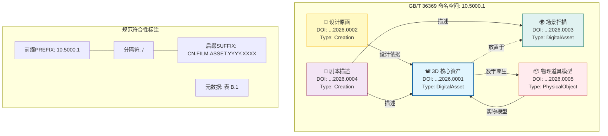

# GB/T 36369 电影数字对象标识符体系可视化

下图展示了在一个典型的电影制作场景中，如何利用 **GB/T 36369 (ISO 26324 IDT)** 标准对不同模态的资产进行唯一标识与关联。

## 1. 标识符结构示意图

## 2. 标识符实例对照表

为便于理解，下表详细列出了上图中各资产的 DOI 编码规范及其所属的 GB/T 36369 类别：

| 资产角色            | DOI 完整标识符                | GB/T 36369 对象类型      | 关联逻辑                 | 业务价值                                         |
| :------------------ | :---------------------------- | :----------------------- | :----------------------- | :----------------------------------------------- |
| **核心资产**  | `10.5000.1/ASSET.2026.0001` | **DigitalAsset**   | 源于概念图，用于实物打印 | **全流程中枢**：连接创作意图与物理制作。   |
| **设计原画**  | `10.5000.1/ASSET.2026.0002` | **Creation**       | 设计依据 -> 核心资产     | **版权溯源**：确立 3D 资产的初始外观版权。 |
| **场景扫描**  | `10.5000.1/ASSET.2026.0003` | **DigitalAsset**   | 包含 -> 核心资产         | **空间容器**：提供资产存在的 3D 坐标系。   |
| **剧本/描述** | `10.5000.1/ASSET.2026.0004` | **Creation**       | 描述 -> 核心资产         | **语义索引**：通过文本搜索资产的依据。     |
| **物理道具**  | `10.5000.1/ASSET.2026.0005` | **PhysicalObject** | 实物模型 -> 核心资产     | **虚实映射**：片场实物管理与库存追踪。     |

*注：前缀 `10.5000.1` 假定为“国家电影数字资产平台”的中国 DOI 注册中心 (ISTIC)注册代号。*

## 3. 规范符合性说明

1. **分层结构标识 (Syntax)**:
   * **Prefix**: `10` (DOI目录) + `5000.1` (注册机构代码).
   * **Suffix**: `CN.FILM...` 采用分段式命名，确保在 PB 级资产库中的唯一性。
2. **元数据解析 (Resolution)**:
   * 符合 GB/T 36369 附录 B 的元数据定义。
   * 通过 `Referent Identifier` 字段实现图中的连线关系，支持双向溯源（例如：查道具可知其出自哪场戏、对应哪个实物）。
