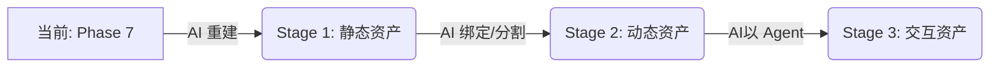

# 电影数字资产演进模型 (The Evolution of Digital Assets)

本模型定义了数字资产从“死数据”向“智能体”进化的三个里程碑。我们的核心理念是：**数字资产 = 存储 + AI 赋能**。

## 🏆 演进阶段 (The Three Stages)

### 第一阶段：静态资产 (Static Assets)
> **"所见即所得" (Renderable, Not Driveable)**

*   **核心定义**: 几何与外观的数字化复刻。
*   **关键特征**: 可渲染 (Renderable)、高保真 (High-Fidelity)、不可驱动 (Static)。
*   **技术栈**: 三维重建 (Reconstruction), 神经渲染 (NeRF/3DGS), 传统建模。
*   **本项目 (Phase 7) 状态**: ✅ **已达成**。
    *   我们通过 `ml-sharp` (场景) 和 `TRELLIS` (道具) 实现了静态资产的自动化生产。

### 第二阶段：动态/可计算资产 (Dynamic / Computable Assets)
> **"结构化与可控" (Driveable, Reason-able)**

*   **核心定义**: 具备拓扑结构和语义信息的资产。
*   **关键特征**: 可驱动 (Driveable)、可推理 (Reason-able)、参数化 (Parametric)。
*   **关键能力**:
    *   **骨骼绑定 (Rigging)**: 从 Mesh 中自动提取骨骼和蒙皮权重。
    *   **物理属性 (Physics)**: 质量、摩擦力、弹性系数的自动标注。
    *   **语义分割 (Part Segmentation)**: 知道哪是车轮（能转），哪是车门（能开）。
*   **技术栈**: 模型驱动 (Model Driving), 动作生成 (Motion Gen), 自动绑定 (Auto-Rigging).
*   **下一步计划**: 这是一个巨大的价值跃迁点。我们需要引入 `Auto-Rigging` AI 模型。

### 第三阶段：可交互资产 (Interactive Assets)
> **"有灵魂的智能体" (Autonomous, Collaborative)**

*   **核心定义**: 拥有行为逻辑和状态机的智能实体。
*   **关键特征**: 自主交互 (Autonomous)、多体协同 (Multi-Agent)、环境感知 (Context-Aware)。
*   **关键能力**:
    *   **行为树 (Behavior Tree)**: AI 自动生成行为逻辑（如“看见人就逃跑”）。
    *   **具身智能 (Embodied AI)**: 资产能在虚拟环境中“活”下来。
*   **技术栈**: 空间计算 (Spatial Computing), 强化学习 (RL), LLM Agent.

---

## 🗺️ 我们的位置与路线图

**结论**: 
目前的 Pre-Study 处于 **Stage 1 的成熟期**。
我们不仅生成了“皮囊”（Mesh/Texture），还通过 `harvest_manifest.json` 和 `lighting_probe.json` 为进入 **Stage 2** 储备了必要的元数据（Metadata）。未来的工作重心将从“生成像素”转向“生成结构”。
