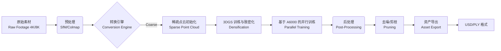

# 技术架构文档 (Technical Architecture)

**文档状态**: 实验验证阶段 - 反映当前多技术路线并行探索的真实情况  
**最后更新**: 2026-02-21

## 0. 架构演进说明

本项目处于**技术验证阶段**，目前并非单一技术路线，而是**四条并行技术路线的对比实验**：

| 路线 | 核心技术 | 适用场景 | 当前状态 |
|------|---------|---------|---------|
| **A: 场景重建** | ml-sharp + DUSt3R + 3DGS | 大场景/环境 | ✅ 可用 |
| **B: 单图生成** | TRELLIS (Image-to-3D) | 独立道具 | ✅ 生产就绪 |
| **C: SAM3D** | SAM 3D Objects | 多物体场景 | 🟡 实验中 (2026-02-21) |
| **D: 视频重建** | COLMAP/GLOMAP + 3DGS | 高保真场景 | 🟡 实验中 |

**设计理念**: 不预设"最优方案"，而是通过实际数据对比各技术路线的优劣，为后续决策提供依据。

## 1. 核心算法对比：3DGS vs NeRF (Algorithm Strategy)

在电影内容资产化场景下，我们对比了 **NeRF (Neural Radiance Fields)** 与 **3DGS (3D Gaussian Splatting)**：

| 维度 | NeRF (e.g., Instant-NGP) | 3DGS (Gaussian Splatting) | 结论 |
| :--- | :--- | :--- | :--- |
| **表示形式** | 隐式神经网络 (MLP) | 显示点云 (Gaussians) | **3DGS 胜出**：显式资产易于编辑、导入/导出标准引擎 (UE5/Unity)。 |
| **训练速度** | 快 (分钟级) | 极快 (分钟级) | **3DGS 胜出**：迭代反馈更即时。 |
| **渲染速度** | 慢 (需光追/Raymarching) | 极快 (光栅化，>100FPS) | **3DGS 胜出**：支持 4K+ 实时预览，符合导演审查需求。 |
| **抗噪能力** | 较强 (平滑) | 一般 (易产生 Floaters) | **NeRF 优势**：但 3DGS 可通过正则化项优化。 |
| **显存占用** | 低 (网络权重) | 高 (百万级高斯点) | **需优化**：通过 A6000 (48GB) 大显存优势 + 剪枝算法解决。 |

**实施策略**：
*   **Base Model**: 采用官方 `3D-Gaussian-Splatting` (Inria) 作为基线。
*   **Optimization**: 引入 `Scaffold-GS` 架构，利用其能够根据场景复杂度动态增删高斯点的特性，显著减少非关键区域的显存占用，同时保持核心主体的细节纹理。

## 2. 工程化转换管线设计 (Engineering Pipeline)

### 关键技术点：
1.  **大分辨率支持 (4K Optimization)**：针对 A6000 显存限制，**放弃硬性的 Tiled-Based 分块训练**（避免接缝问题）。采用 **Progressive Resolution + Random Crop** 策略：
    *   **Phase 1**: 在 1K/2K 下快速收敛几何形态。
    *   **Phase 2**: 在 4K 下使用随机裁切 (Random Crops) 进行高频细节的反向传播。
    *   **Memory Guard**: 动态控制 Gaussian 总数，定期剔除贡献度低的点。
2.  **Alpha 遮罩处理**：电影绿幕素材自带 Alpha 通道。不进行硬切割，而是将 Alpha 作为 **Loss Weighting**（监督权重），重点优化边缘区域，同时确保预乘 Alpha (Premultiplied Alpha) 的正确混合，防止产生边缘光晕。

## 3. 质量评测数学模型 (Quality Evaluation Model)

建立“客观数据”与“主观体验”的映射关系。

### 3.1 信号保真度 (Signal Fidelity)
*   **PSNR (Peak Signal-to-Noise Ratio)**: 衡量像素级差异。目标：> 32dB。
*   **SSIM (Structural Similarity)**: 衡量结构信息丢失。目标：> 0.95.
*   **LPIPS (Learned Perceptual Image Patch Similarity)**: 使用 VGG 网络提取特征对比，更符合人眼对纹理的感知。目标：< 0.1。

### 3.2 资产完整性 (Asset Integrity)
*   **Floaters Ratio (漂浮点占比)**: 计算远离主体的离散高斯点数量。过多的 Floaters 会导致渲染伪影。
*   **Multi-view Consistency (多视角一致性)**: **[NEW]** 计算重投影误差 (Reprojection Error) 和深度图一致性 (Depth Consistency)。PSNR 无法识别的“视觉合理但在 3D 空间错误”的伪影将通过此指标检出。
*   **Luma Consistency (亮度一致性)**: 在重光照测试中，检测物体表面反照率 (Albedo) 是否纯净。

## 4. 硬件适配方案 (Hardware Optimization)

**目标平台**：单卡 NVIDIA RTX A6000 (48GB VRAM)

*   **内存管理策略**：
    *   **VRAM 占用分析**：4K 图片 Tensor 占用极大。策略：使用 `uint8` 存储 CPU 端图片，仅在训练当前 Batch 时上传并转为 `float32`，利用 PCIe 4.0 高带宽进行 Swap。
    *   **CUDA Kernel 优化**：针对 A6000 的 Ampere 架构，优化 Rasterizer 的 Tile 排序算法，利用 Tensor Cores 加速协方差矩阵计算。

*   **部署环境**：
    *   OS: Ubuntu 22.04 LTS (用户当前环境)
    *   CUDA: 11.8 / 12.1
    *   Python: 3.10
    *   PyTorch: 2.1+ (with CUDA support)

## 5. 预期交付物形态 (Deliverables)
1.  **Repo**: `movie-asset-3dgs`
2.  **CLI Tool**: `asset-convert --input <folder> --quality cinema --output <file.ply>`
3.  **Viewer Instructions**: 并不是开发新查看器，而是提供现有工业软件（UE5, SIBR）的加载配置与插件。
